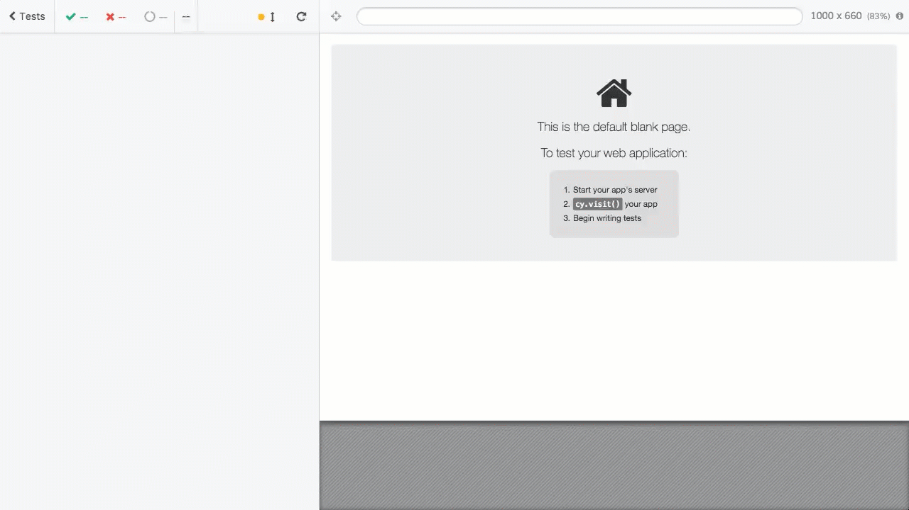
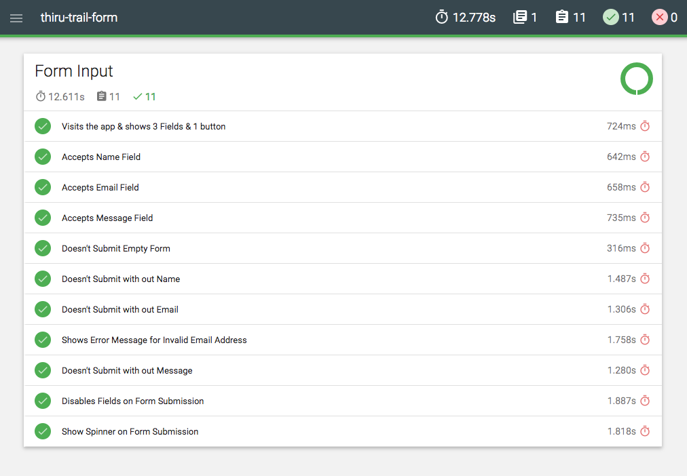

# React-Redux-Form

## Task
Please build a responsive form. The form should include a `Name`, `Email` and `Message` field.
The labels should be next to the inputs on a big screen and above on a small screen `(<= 600px)`.

When the user submits the form, sending of the data should be simulated with a timeout. While sending a loading indicator should be shown and all inputs must not be accessible.

Please add a test that checks if the form submits its data when the submit button gets clicked.

You are totally free in deciding how you build this. If anything is unclear to you, just make an assumption and proceed with what you think makes sense. 

## Installation & Pre-requisites

### 1. Installation

```bash
yarn install
```

### 2. How to run the application

```bash
yarn dev
```

#### 3. Run tests
To run headless browser testing, which would generate Video report & HTML Report. 

```bash
yarn cypress:all
```


To run testing using Chrome Browser
```bash
yarn cypress
```

## Test Reports 

| [](https://youtu.be/VYhYG9YP16w) |
| :------------------------------------------------------------------------------------------------------------------: |
|                              **Thiru-Trail-Form - Test Suite Demo**                               |

| [](https://thiruppathi.github.io/trail-form/mochawesome-report/mochawesome.html) |
| :------------------------------------------------------------------------------------------------------------------: |
|                              **Thiru-Trail-Form - Test Suite Report**                               |


## Light House Reports

To check the quality, performance, a11y, best practices of the application, I've used Light House.


## Technology Stack

- **Front-End**
  - React, Redux, Redux-Thunk, Redux-Form
- **Task Runners, Build Process & Development Workflow**
  - Prettier
- **Source Control**
  - GitHub
- **IDE & Dev Tools**
  - VS Code
  - LightHouse
  - Chrome Dev Tools
- **Testing**
  - [Cypress.IO](https://cypress.io) 
- **Deployment & Hosting**
  - [Zeit-Now](https://zeit.co/now)
- **Icons Credits**
  - [Flaticon](https://www.flaticon.com/)


## Assumption
- No need of Backend
- Delayed Form Submission - Simulation with `setTimeout`
- Freedom to choose Testing Methodology
- Freedom to choose additional library (Redux-Form)
- It was setup with [create-react-app](https://github.com/facebook/create-react-app)